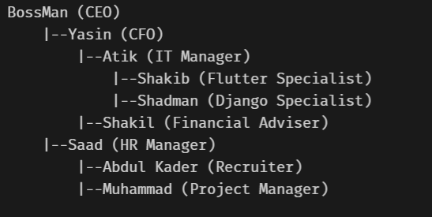
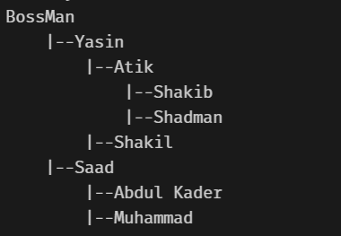

# Tree

1. Below is the management hierarchy of a company.

   

Copy [tree class](https://github.com/Rakib/data-structure-and-algorithm/blob/master/data-structures/tree/tree.py) from `tree.py` script so that it takes **name** and **designation** in data part of TreeNode class.
Now extend print_tree function such that it can print either name tree, designation tree or name and designation tree. As shown below,





Here is how your main function should will look like,

```
if __name__ == '__main__':
    root_node = build_management_tree()
    root_node.print_tree("name") # prints only name hierarchy
    root_node.print_tree("designation") # prints only designation hierarchy
    root_node.print_tree("both") # prints both (name and designation) hierarchy
```

2. Build a location tree using **TreeNode** class

Now modify print_tree method to take tree level as input. And that should print tree only upto that level as shown below,


